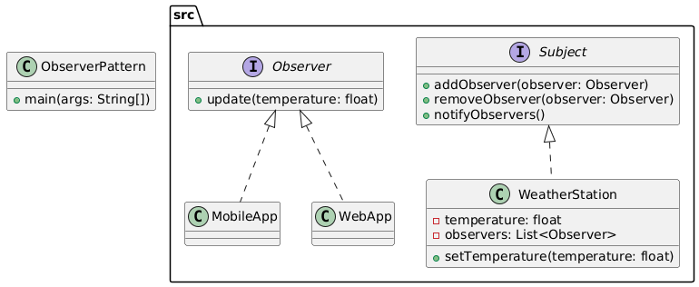

# Observer Pattern

The Observer Pattern is a behavioral design pattern that defines a one-to-many dependency between objects. When the state of one object (the subject) changes, all its dependent objects (observers) are notified and updated automatically. This pattern is commonly used to implement distributed event handling systems, such as user interface listeners or real-time data updates.

## Example: Weather Station
In the Weather Station example, the **WeatherStation** keeps track of observers like **MobileApp** and **WebApp**. When the temperature changes, it notifies all observers, and each observer updates itself with the new temperature. This way, the station and the displays are connected but independent.

## Class Diagram


## Files
- `ObserverPattern.java`: Main class to run the program
- `src/`: Contains all Observer Pattern classes and interfaces
- `class_diagram.png`: Generated class diagram image

## Example Output
```
Mobile App: New Temperature = 25.3°C
Web App: New Temperature = 25.3°C
Mobile App: New Temperature = 30.5°C
Web App: New Temperature = 30.5°C
```


