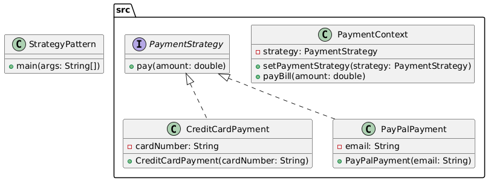

# Strategy Pattern

The Strategy Pattern defines a family of algorithms, encapsulates each one, and makes them interchangeable. Strategy lets the algorithm vary independently from clients that use it.

## Example: Payment Method Selection
This example demonstrates how a payment system can use different payment strategies (Credit Card, PayPal) interchangeably at runtime.

## Class Diagram


## Files
- StrategyPattern.java: Main class to run the example
- src/: Contains all Strategy Pattern classes and interfaces
- class_diagram.png: Generated class diagram image

## Example Output
```
Paid 500.0 using Credit Card: 1234-5678-9876-5432
Paid 750.0 using PayPal account: user@gmail.com
```
