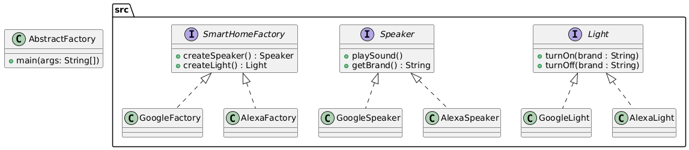

# Abstract Factory Pattern

The Abstract Factory Pattern provides an interface for creating families of related or dependent objects without specifying their concrete classes. It is useful when the system needs to be independent of how its objects are created, composed, and represented.

## Example: Smart Home Devices

This example demonstrates the Abstract Factory Pattern by simulating a smart home system that can use either Google or Alexa devices. The user selects a brand, and the system creates the appropriate speaker and light objects for that brand.

## Class Diagram


## Files
- `AbstractFactory.java`: Main class to run the example
- `src/`: Contains all Abstract Factory Pattern classes and interfaces
- `class_diagram.png`: Generated class diagram image

## Example Output
```
1. Google
2. Alexa
Enter Choice: 1
Google Speaker: Playing Sound...
Google Light: Turning ON...
Turn OFF light? (Yes/No): Yes
Google Light: Turning OFF...
```

*Output will vary depending on user input and brand selection.*
