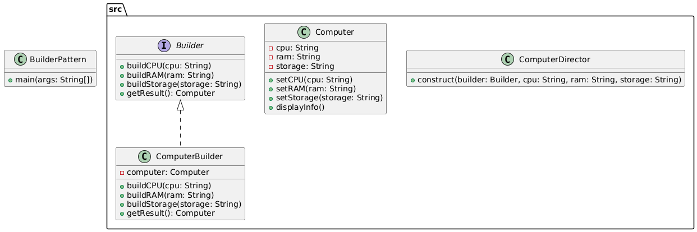

# Builder Pattern

A creational design pattern that separates the construction of a complex object from its representation, allowing the same construction process to create different representations.

## Example: Computer Builder
Builds a customizable `Computer` object by specifying CPU, RAM, and Storage using a builder and director.

## Class Diagram


## Files
- BuilderPattern.java: Main class to run the program
- src/: Contains all Builder Pattern classes and interfaces
- class_diagram.png: Generated class diagram image

## Example Output
```
Enter CPU: Intel i7
Enter RAM: 16GB
Enter Storage: 1TB SSD
Configuration:
CPU: Intel i7
RAM: 16GB
Storage: 1TB SSD
```

