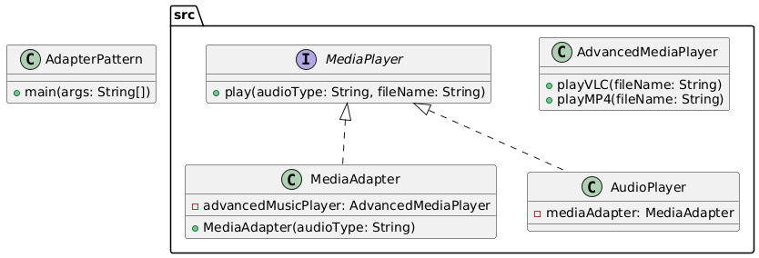

# Adapter Pattern

Adapts the interface of a class into another interface clients expect. The Adapter Pattern lets classes work together that couldn't otherwise because of incompatible interfaces.

## Example: Audio Player Adapter
Allows an audio player to play different types of media files (mp3, mp4, vlc) by using an adapter to translate requests to the appropriate player.

## Class Diagram


## Files
- AdapterPattern.java: Main class to run the example
- src/: Contains all Adapter Pattern classes and interfaces
- class_diagram.png: Generated class diagram image

## Example Output
```
Playing MP3 file: song1.mp3
Playing MP4 file: video1.mp4
Playing VLC file: movie1.vlc
Invalid media type: avi
```
