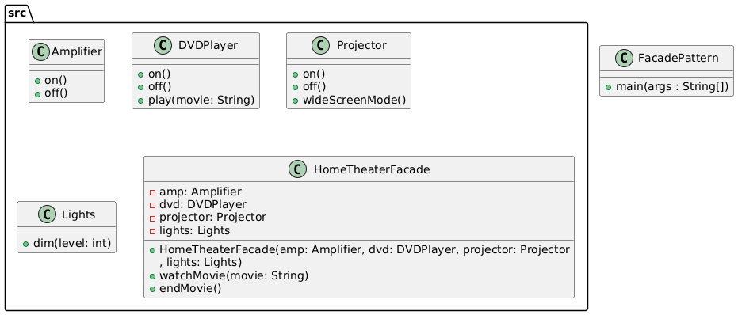

# Facade Pattern

Simplifies the interface for a set of complex subsystems by providing a unified, higher-level interface.

## Example: Home Theater
A home theater system with multiple components (amplifier, DVD player, projector, lights) is controlled through a single facade interface.

## Class Diagram


## Files
- FacadePattern.java: Main class to run the program
- src/: Contains all Facade Pattern classes
- class_diagram.png: Generated class diagram image

## Example Output
```
Get ready to watch a movie...
Lights dimmed to 20%
Projector is ON
Projector in widescreen mode
Amplifier is ON
DVD Player is ON
Playing movie: Inception

Shutting movie theater down...
Lights dimmed to 100%
Projector is OFF
Amplifier is OFF
DVD Player is OFF
```
