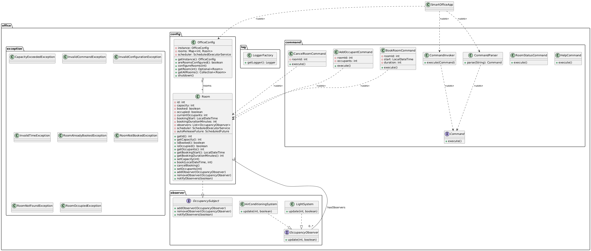

# Smart Office Facility

A console-based Java application to manage a smart office facility. The system handles conference room bookings, occupancy detection, and automates the control of air conditioning and lighting based on room occupancy.

---

## Overview

The Smart Office Facility application allows users to configure meeting rooms, book and cancel room bookings, and manage room occupancy. The system automatically controls air conditioning and lighting based on occupancy and releases unoccupied room bookings after 5 minutes.

**Key Features:**
- Configure total number of meeting rooms.
- Book and cancel room reservations.
- Detect room occupancy automatically (at least 2 people).
- Automatically release bookings for unoccupied rooms.
- Automate AC and lighting based on room occupancy.

---

## Functional Requirements

**Mandatory Requirements:**
1. Configure the office facility by specifying the number of meeting rooms.
2. Book and cancel conference room bookings.
3. Detect occupancy using sensors (at least 2 people).
4. Automatically release unoccupied rooms if not occupied within 5 minutes.
5. Turn off AC and lights in unoccupied rooms.

---

## Key Focus & Design Patterns

The project demonstrates the following design patterns:

- **Singleton Pattern:**  
  Ensures `OfficeConfig` is a single instance throughout the application for consistent office configuration management.

- **Observer Pattern:**  
  `AirConditioningSystem` and `LightSystem` act as observers subscribing to `Room` occupancy changes. They automatically turn AC and lights on/off based on occupancy.

- **Command Pattern:**  
  Handles booking, cancellation, and room status commands through the `Command` interface and its implementations (`BookRoomCommand`, `CancelRoomCommand`, `AddOccupantCommand`, etc.), allowing flexible and extendable operations.

---

## Architecture & Design

The application is organized into four main packages:

1. **office.config** – Room and office configuration management (`Room`, `OfficeConfig`).  
2. **office.observer** – Occupancy observers like AC and lighting systems (`OccupancyObserver`, `OccupancySubject`, `AirConditioningSystem`, `LightSystem`).  
3. **office.command** – Command pattern classes to handle operations (`Command`, `CommandInvoker`, `CommandParser`, concrete commands).  
4. **office.exception** – Custom exceptions for validation and error handling.  
5. **office.log** – Logger factory for centralized logging configuration.

---

## Classes & Components

**Main Classes:**
- `Room` – Represents a conference room, tracks booking, occupancy, and observers.  
- `OfficeConfig` – Singleton managing all rooms and scheduling tasks.  
- `CommandParser` – Parses user input into command objects.  
- `SmartOfficeApp` – Main application loop.

**Observers:**
- `AirConditioningSystem` – Turns AC on/off based on room occupancy.  
- `LightSystem` – Turns lights on/off based on room occupancy.

**Command Implementations:**
- `BookRoomCommand`, `CancelRoomCommand`, `AddOccupantCommand`, `RoomStatusCommand`, `HelpCommand`.

**Exceptions:**
- `CapacityExceededException`  
- `InvalidCommandException`  
- `InvalidConfigurationException`  
- `InvalidTimeException`  
- `RoomAlreadyBookedException`  
- `RoomNotBookedException`  
- `RoomNotFoundException`  
- `RoomOccupiedException`

---

## Logging

- Implemented using `LoggerFactory` with Java `Logger`.  
- Logs are written to both console and `office/log/smartoffice.log`.  
- Logging Levels Used:  
  - `INFO` → Successful configuration, booking, occupancy changes.  
  - `WARNING` → Invalid input, booking conflicts, capacity exceeded.  
  - `SEVERE` → Critical failures (room not found, unexpected errors).

---

## Class Diagram



---

## Usage / How to Run

**Prerequisites:**
- Java 17 or higher.
- Terminal or command prompt.

**Steps:**

1. Clone this repository

2. Compile all Java files:
```bash
javac -d bin office\command\*.java office\config\*.java office\exception\*.java office\log\*.java office\observer\*.java SmartOfficeApp.java
```

3. Run the application:
```bash
java -cp bin SmartOfficeApp
```

---

## Sample Commands & Outputs

### Positive Cases

```
Config room count 3
Output: "Office configured with 3 meeting rooms."

Config room max capacity 1 10
Output: "Room 1 maximum capacity set to 10."

Add occupant 1 2
Output: "Room 1 is now occupied by 2 persons. AC and lights turned on."

Book room 1 09:00 60
Output: "Room 1 booked from 09:00 for 60 minutes."

Cancel room 1
Output: "Booking for Room 1 cancelled successfully."

Add occupant 1 0
Output: "Room 1 is now unoccupied. AC and lights turned off."
```

### Negative Cases

```
Book room 1 09:00 60 (already booked)
Output: "Room 1 is already booked during this time."

Cancel room 2 (not booked)
Output: "Room 2 is not booked. Cannot cancel booking."

Add occupant 2 1
Output: "Room 2 occupancy insufficient to mark as occupied."

Add occupant 4 2 (non-existent room)
Output: "Room 4 does not exist."

Config room max capacity 1 -5
Output: "Invalid capacity. Please enter a valid positive number."

Room status 1 (unoccupied > 5 mins)
Output: "Room 1 is now unoccupied. Booking released. AC and lights off."
```

---
